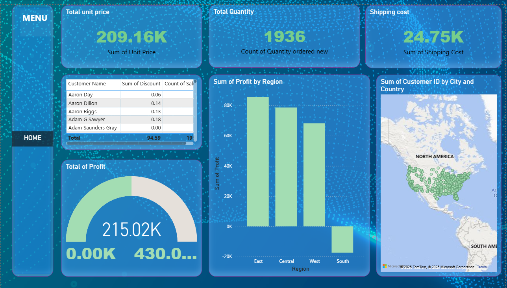

# Product Sales Analysis Dashboard 📊

## Overview
This project is a Power BI dashboard designed to analyze **product sales performance**.  
It provides interactive insights into revenue, sales trends, product categories, and customer behavior.

## Features
- Sales overview with total revenue, profit, and growth trends
- Product-wise performance analysis
- Regional and category-level breakdowns
- Interactive filters for time, region, and product category
- KPI cards for quick business insights

## Tools & Technologies
- **Power BI** for visualization
- **Data Modeling** with relationships
- **DAX** for calculated measures and KPIs
- **Excel/CSV** data source

## Files in Repository
- `product_sales_analysis.pbix` → Main Power BI dashboard
- `/images/` → Screenshots of dashboard views
- `README.md` → Project documentation

## How to Use
1. Clone the repo or download the `.pbix` file.
2. Open it in **Power BI Desktop**.
3. Connect to your data source if needed (sample data included in PBIX).

## Preview

## Author
👤 **Shubham M. Gawade**  
[LinkedIn](https://www.linkedin.com/in/shubham-gawadedev/) | [GitHub](https://github.com/shubhamgawade944)
